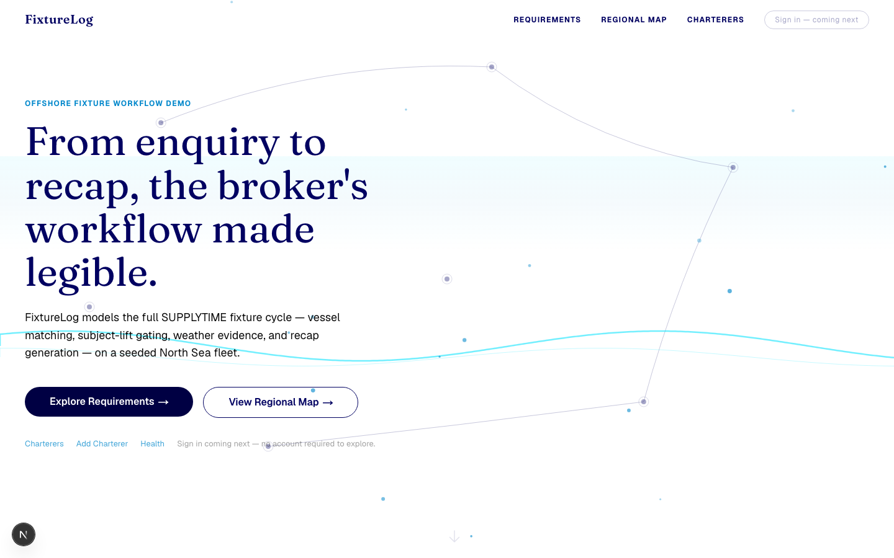
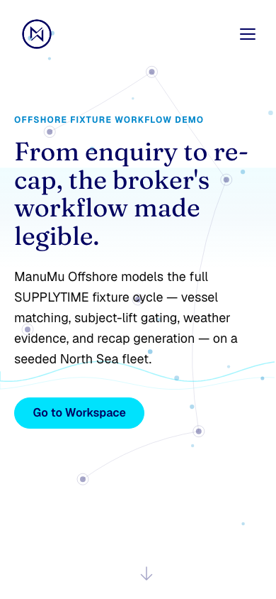

# FixtureLog

> An offshore charter enquiry lands — which vessel, at what rate, in what weather window?

Capture a client requirement, match available offshore vessels, record the fixture, generate the recap, check the marine weather window, and see where vessels are on a live map — the shortest credible path from an offshore enquiry to a fixed deal.

<p align="center">
  <a href="#"><strong>Live Demo</strong></a> · <a href="docs/specs/SPEC-001-mvp-build.md"><strong>Build Spec</strong></a> · <a href="docs/GLOSSARY.md"><strong>Glossary</strong></a> · <a href="https://github.com/manumu-studio/fixturelog"><strong>Source Code</strong></a>
</p>

<p align="center"><em>v1.5.0 — the broker desk now carries deterministic sanctions/operator-risk screening: local normalized fixture data screens charterers, vessels, owners, and operators; provenance-carrying badges surface risk; and <code>ON_SUBS → FIXED</code> is blocked when screening is stale, unresolved, or true <code>BLOCKED</code>. The grounded AI Broker Copilot can explain stored screening evidence but cannot clear, override, or give legal advice.</em></p>

---

<p align="center">
  
</p>

---

## What it does

FixtureLog is a portfolio demo of a realistic **offshore shipbroking workflow** — an Offshore Fixture Board + Recap Generator with a marine weather check and a regional vessel map, built as a demonstration for an SSY (Simpson Spence Young) Full-Stack Developer role.

A broker captures a charterer's **requirement**, runs a pure two-stage **matching engine** (hard filters → weighted composite score) to produce a ranked vessel shortlist with a per-factor breakdown, records the **fixture** (the agreed deal) through a subject-gated and sanctions-gated status machine, generates a deterministic **SUPPLYTIME 2017 recap** in Markdown and plain text, checks whether marine weather supports the work window via an **Open-Meteo** verdict (`WORKABLE` / `MARGINAL` / `NOT_WORKABLE`), and visualises seeded vessel positions on a **Leaflet** map. The AI Broker Copilot adds a grounded, confirm-gated runtime LLM on top, but the deterministic backend stays the only path to a write — the source of truth. Scope, status enums, and data model are locked in [SPEC-001](docs/specs/SPEC-001-mvp-build.md); domain vocabulary lives in the [glossary](docs/GLOSSARY.md).

## Pages

The landing is public; everything else is authenticated and **role-gated**. After login a charterer (CLIENT) lands on the portal and a broker (BROKER) on the dashboard — a `/api/auth/post-login` hop routes each role to its home, and each guard bounces the other role away.

| Route | Audience | What it shows |
|---|---|---|
| `/` | Public | Maritime landing — hero canvas, feature showcase, public **Fleet teaser**, role-based sign-in / sign-up CTAs |
| `/portal` 👤 | Charterer | **Dashboard** — your active enquiries, pending actions, and fixture/weather timeline |
| `/portal/enquiries` · `/portal/enquiries/new` · `/portal/enquiries/[id]` 👤 | Charterer | Your enquiries, the create-enquiry form, and detail with a recommended-vessel shortlist |
| `/portal/fixtures` · `/portal/documents` 👤 | Charterer | Your fixtures (status, subjects, weather) and your recap documents (copy / download) |
| `/dashboard` 🔒 | Broker | **Broker home** — the broker-wide incoming queue (same three zones, all charterers) |
| `/map` 🔒 | Charterer + Broker | Available-vessels map — color-coded Leaflet markers from seeded position snapshots |
| `/requirements` · `/requirements/[id]` 🔒 | Broker | Requirement list with status badges, and shortlist detail with per-factor score breakdown |
| `/charterers` · `/charterers/[id]` 🔒 | Broker | Charterer list and detail with linked requirements and fixtures |

<p align="center">
  
</p>

## Architecture

```
┌──────────────────────────────────────┐
│        Next.js 15 · App Router        │   Vercel
│   React 19 · Leaflet · motion · Zod   │
└────────────────────┬─────────────────┘
                     │  Route Handlers (Node runtime)
┌────────────────────▼─────────────────┐
│         Service layer (pure TS)       │
│ Matcher · Recap · Weather · Status ·  │
│        Sanctions Screening            │
└────────────────────┬─────────────────┘
                     │  Prisma 6
┌────────────────────▼─────────────────┐
│            PostgreSQL 16              │   Neon
│ Vessels · Fixtures · ScreeningResult  │
└──────────────────────────────────────┘
```

## API

21 broker/domain endpoints plus charterer portal APIs, a broker dashboard API, a public health check, and the public Auth.js endpoints (`/api/auth/*`). Every external payload crosses a Zod boundary, and protected handlers return 401 JSON when unauthenticated. Write routes resolve the acting actor from the session — never from the request body — so a caller cannot impersonate another broker or charterer.

| Method | Route | Description |
|---|---|---|
| GET | `/api/health` | Health check (public) |
| GET · POST | `/api/charterers` | List charterers · register a charterer |
| GET | `/api/charterers/[id]` `/requirements` `/fixtures` | Charterer detail + linked requirements and fixtures |
| GET | `/api/vessels` · `/api/vessels/[id]` | List vessels (filterable) · vessel detail |
| GET | `/api/vessels/positions` | Latest position snapshot per vessel (map data) |
| GET · POST | `/api/fixtures` | List · create a fixture |
| GET | `/api/fixtures/[id]` | Fixture detail (includes `weatherSnapshots`) |
| PATCH | `/api/fixtures/[id]/status` | Transition fixture status (subject-gated + sanctions-gated before `FIXED`) |
| POST | `/api/fixtures/[id]/recap` | Generate a SUPPLYTIME 2017 recap |
| POST · PATCH | `/api/fixtures/[id]/subjects` | Add a subject · update subject status |
| GET · POST | `/api/weather/marine` · `/api/fixtures/[id]/weather` | Ad-hoc marine verdict · persist a `WeatherSnapshot` |
| GET · POST | `/api/requirements` | List (filterable, includes screening badge data) · create (`status: ENQUIRY`, screens charterer) |
| GET | `/api/requirements/[id]` | Requirement detail |
| POST | `/api/requirements/[id]/match` | Run matching engine → ranked shortlist; `ENQUIRY → SHORTLISTED` |
| GET · POST | `/api/portal/enquiries` | Charterer-scoped enquiry list · create enquiry |
| GET | `/api/portal/{dashboard,enquiries/[id],fixtures,documents}` | Charterer-scoped portal data |
| GET | `/api/broker/dashboard` | Broker-wide queue and dashboard data |

## Stack

| Layer | Technology |
|---|---|
| **Frontend** | Next.js 15 (App Router), React 19, TypeScript (strict), motion, Zod |
| **Auth** | Auth.js (NextAuth v5 beta) — shared ManuMuStudio OIDC provider, JWT sessions, layout + handler gating, `AppUser`→`Broker`/`Charterer` actor mapping |
| **Mapping** | Leaflet 1.9.4 + react-leaflet 5, OpenStreetMap tiles |
| **Services** | Pure-TS service layer — matching, recap, weather enrichment, status policy, sanctions screening |
| **ORM / Data** | Prisma 6, seeded Postgres, local normalized sanctions fixture data, Open-Meteo Marine API (AIS deferred) |
| **Database** | PostgreSQL 16 (Neon) |
| **Infra** | Vercel (app), Neon (db), GitHub Actions CI/CD (4-job pipeline) |
| **Quality** | Vitest + v8 coverage, Playwright E2E, ESLint, `tsc` strict, Husky pre-commit |

## Quick start

```bash
# Prerequisites: Node.js 20+, a PostgreSQL 16 database (Neon or local)
npm install                          # runs `prisma generate` via postinstall
cp .env.example .env                 # set DATABASE_URL, NEXT_PUBLIC_APP_URL, and the AUTH_* / NEXTAUTH_* vars
npx prisma migrate dev               # applies all migrations (incl. auth_integration)
npx prisma db seed                   # vessels, owners, charterers, fixtures, requirements, positions
npm run dev                          # http://localhost:3000

# Verify
npm run typecheck && npm run lint
npm run test                         # unit test suite
npm run test:e2e                     # Playwright: smoke · happy-path · map · landing
```

## Project structure

```
src/
  middleware.ts         # baseline security headers (edge-safe; excludes /api/auth/*)
  app/
    page.tsx            # public animated landing (role-based CTAs + Fleet teaser)
    portal/             # charterer Client Portal (charterer-gated): dashboard · enquiries · fixtures · documents
    (app)/              # broker route group (requireSession) — dashboard · map · requirements · charterers
    auth/error/         # auth error page
    api/
      auth/             # Auth.js handlers · federated sign-out · post-login role hop (public)
      portal/           # charterer-scoped: dashboard · enquiries · fixtures · documents
      broker/           # broker-wide: dashboard
      …                 # 21 domain route handlers (session-gated) + /health (public)
  components/
    landing/            # landing sections — each a 4-file component (incl. AuthCta · FleetTeaser)
    portal/             # token-only design kit: PortalShell · PortalNav · PortalButton · PortalCard ·
                        #   PortalPageHeader · StatusBadge · EmptyState · Modal · Lightbox · dashboard zones
  features/
    map/                # RegionalMap · RegionalMapClient · VesselMarker · useRegionalMap (onVesselClick)
    fleet-explorer/     # VesselCard · VesselGallery · VesselModal · FleetExplorer (map + gallery + modal)
    enquiry/            # CreateEnquiryForm · useCreateEnquiry
    auth/               # NextAuth config · sign-in/up server actions · useSession · types
  lib/
    auth/               # requireSession · require-charterer · require-broker · resolve-role · resolve-home-route
    services/           # FixtureMatcher · RecapFormatter · WeatherEnricher · sanctions-screening/ · portal/
    utils/              # haversine (nm) · dp-class ranking · format (date/money)
    validators/         # Zod schemas at every boundary (incl. portal DTOs)
    env.ts · env.server.ts   # split public / server env validation (secrets stay server-only)
prisma/
  schema.prisma         # domain model + status/screening enums + AppUser mapping + vessel images + ScreeningResult audit trail
  seed.ts               # 30 seeded vessels (honesty-labelled images; 21 real photos, 16 real IMOs) + full two-sided workflow data
public/assets/vessels/  # per-type house-art SVGs (STOCK) + real/ CC photos of same-named ships (WIKIMEDIA) — both honesty-labelled
e2e/                    # Playwright: smoke · happy-path · map · landing
docs/                   # specs · ADRs · research · journal · PRs · glossary
```

## Architecture decisions

Key decisions are recorded as ADRs in [`docs/decisions/`](docs/decisions/):

- **Honesty rule for data** — seeded Postgres + live Open-Meteo weather; AIS deferred; every datum tagged by source and confidence ([ADR-0002](docs/decisions/ADR-0002-data-and-integration-strategy.md))
- **Next.js full-stack + pure service layer** — Vercel + Neon, CI/CD parity with the reference pipeline ([ADR-0003](docs/decisions/ADR-0003-application-architecture.md))
- **Research-first, packet-based methodology** — task files before implementation; ship small, ship often ([ADR-0001](docs/decisions/ADR-0001-research-first-methodology.md))
- **Locked MVP contract** — scope tiers, status enums, data model, and build sequence in [SPEC-001](docs/specs/SPEC-001-mvp-build.md)

Project context and decision history: [`docs/architecture/PROJECT-CONTEXT.md`](docs/architecture/PROJECT-CONTEXT.md).

## Interview diagrams

The architecture graphs in [`docs/architecture/INTERVIEW-GRAPHS.md`](docs/architecture/INTERVIEW-GRAPHS.md) are the quick rehearsal pack for interviews:

- CI/CD pipeline from PR to verified deployable build
- Request flow from browser action to validated API response
- Data pipeline from enquiry to fixed fixture and recap
- Runtime flow for Auth.js, protected routes, APIs, Prisma, Neon, and Open-Meteo

## Roadmap

- **Done (v1.5.0)** — sanctions/operator-risk screening slice: additive `Operator`, `ScreeningResult`, `ScreeningReview`, and `Vessel.flagState`; local normalized fixture adapter; 24-hour provenance TTL; charterer screening on requirement create; compact risk badges; and a deterministic pre-`FIXED` gate shared by the route and copilot executor
- **Done (v1.4.0)** — AI Broker Copilot v2: the grounded broker-only chat becomes a bounded tool-using agent (`getFixture` / `findMatches` auto-run; `advanceFixtureStatus` / `generateRecap` are proposed-only and execute only after an explicit broker approval). The deterministic policy stays the only door to the DB
- **Done (v1.3.0)** — two-sided product: charterer Client Portal (`/portal`) + broker Dashboard (`/dashboard`), role-gated identity (`AppUser` → Broker | Charterer), honesty-labelled vessel imagery, charterer-scoped + broker-wide dashboard APIs, and a token-only portal design kit
- **Done (v1.2.0)** — auth integration (shared OIDC sign-in, protected route group + API gating, `AppUser`→`Broker` actor mapping, security-headers middleware)
- **Next** — extend sanctions sources beyond the local fixture adapter (yente/direct government ingestion), add shortlist/fixture-create screening triggers, and keep live AIS deferred to its own stage
- **Shipped, not autonomous** — the runtime copilot is intentionally confirm-gated (a human checkpoint on every write), never an autonomous agent; rationale in [ADR-0004](docs/decisions/ADR-0004-copilot-human-in-the-loop.md)

## Built by

[ManuMu Studio](https://manumustudio.com). The landing's motion pattern is ported from the author's [Helical Bio Explorer](https://github.com/manumu-studio/helical-bio-explorer); the maritime editorial skin (Fraunces type, deep-navy `#000061` / cyan `#00e2fd`) is informed by a public SSY homepage CSS audit. No SSY brand assets, logos, or trademarks were copied.

## License

Independent portfolio demonstration — **not affiliated with or endorsed by SSY (Simpson Spence Young)**. Company facts cited in the research docs are drawn from public sources and tagged for confidence.
