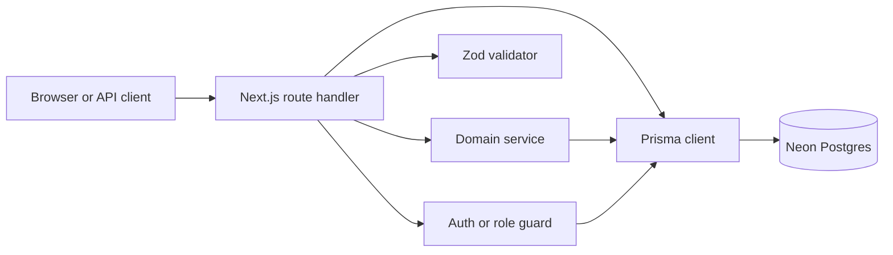
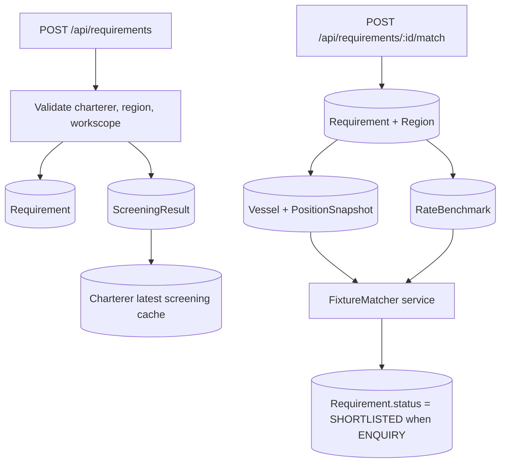
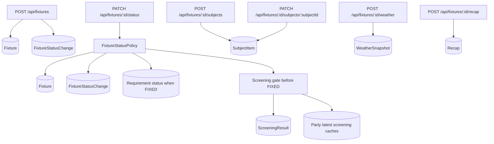

# API To Neon Table Map

This document shows how FixtureLog API routes reach the Neon/Postgres tables. It complements
`docs/architecture/DATABASE-NEON-TABLE-MAP.md`, which explains the tables themselves.

## Reading This Map

Most API calls follow this path:



ASCII version:

```text
Browser or API client
  -> Next.js route handler
      -> Auth / role guard
          -> AppUser
          -> Broker or Charterer
      -> Zod validator
      -> Domain service
      -> Prisma client
          -> Neon Postgres
```

The important design point for the interview: API handlers are thin. They validate input, enforce
role boundaries, and either call Prisma directly for simple reads/writes or delegate to services for
domain logic such as matching, status transitions, weather enrichment, portal scoping, screening, and
recap generation.

## Guard Table Access

These guards run before many API handlers and may touch Neon even when the route's main job is
somewhere else.

| Guard/helper | Used by | Tables reached | Why |
|---|---|---|---|
| `requireApiSession()` | General authenticated APIs | None directly | Reads Auth.js session, returns `401` JSON if anonymous. |
| `requireBrokerApi()` | Broker-only APIs | `AppUser`, `Broker` | Rejects charterers, resolves/provisions the broker actor from the session identity. |
| `requireChartererApi()` | Portal APIs | `AppUser`, `Broker`, `Charterer` | Resolves/provisions the logged-in charterer and scopes every portal query to that charterer. |
| `resolveHomeRoute()` | `GET /api/auth/post-login` | `AppUser`, `Broker` | Chooses `/dashboard` or `/portal` after login. |

## API Route Matrix

| API route | Access | Code path | Tables reached |
|---|---|---|---|
| `GET /api/health` | Public | `checkHealth()` with `prisma.$queryRaw` | No business table; runs `SELECT 1`. |
| `GET/POST /api/auth/[...nextauth]` | Public Auth.js route | Auth.js handlers | No direct table access in this handler. |
| `GET /api/auth/post-login` | Authenticated redirect | `auth()` -> `resolveHomeRoute()` | `AppUser`, `Broker` |
| `GET /api/auth/federated-signout` | Public sign-out route | Cookie cleanup + IdP logout URL | No Neon table. |
| `POST /api/public/assistant-preview` | Public | Curated preview or optional public LLM answer | No Neon table; deliberately no broker data. |
| `POST /api/broker/voice/token` | Broker | `requireBrokerApi()` -> LiveKit token mint | Guard touches `AppUser`, `Broker`; no domain table after guard. |
| `GET /api/broker/dashboard` | Broker | `getBrokerDashboard()` | `Requirement`, `Fixture`, `Charterer`, `Vessel`, `Region`, `Workscope`, `SubjectItem`, `WeatherSnapshot` |
| `POST /api/broker/copilot` | Broker | `getBrokerDashboard()` + copilot tools | Reads dashboard tables; tools may read/write `Requirement`, `Fixture`, `Vessel`, `PositionSnapshot`, `RateBenchmark`, `SubjectItem`, `FixtureStatusChange`, `ScreeningResult`, `Owner`, `Operator`, `Charterer`, `Recap`. |
| `GET /api/charterers` | Authenticated | Direct Prisma list/count | `Charterer`; counts `Requirement`, `Fixture` |
| `POST /api/charterers` | Authenticated | Direct Prisma duplicate check + create | `Charterer` |
| `GET /api/charterers/[id]` | Authenticated | Direct Prisma detail | `Charterer` |
| `GET /api/charterers/[id]/requirements` | Authenticated | Verify charterer, list requirements | `Charterer`, `Requirement`, `Region`, `Workscope` |
| `GET /api/charterers/[id]/fixtures` | Authenticated | Verify charterer, list fixtures | `Charterer`, `Fixture`, `Vessel` |
| `GET /api/requirements` | Broker | Direct Prisma list/count | `Requirement`, `Charterer`, `Region`, `Workscope` |
| `POST /api/requirements` | Broker | Direct Prisma + `persistChartererScreeningForRequirement()` | `Charterer`, `Region`, `Workscope`, `Requirement`, `ScreeningResult`; updates `Charterer` screening cache fields. |
| `GET /api/requirements/[id]` | Broker | Direct Prisma detail | `Requirement`, `Charterer`, `Region`, `Workscope`, `Fixture`, `Vessel` |
| `POST /api/requirements/[id]/match` | Broker | Load data -> `FixtureMatcher` -> optional status update | `Requirement`, `Region`, `Vessel`, `PositionSnapshot`, `RateBenchmark`; may update `Requirement.status`. |
| `GET /api/vessels` | Authenticated | Direct Prisma list/count | `Vessel`, `Owner`, `PositionSnapshot` count |
| `GET /api/vessels/[id]` | Authenticated | Direct Prisma detail | `Vessel`, `Owner`, `Region`, `PositionSnapshot` |
| `GET /api/vessels/positions` | Authenticated | Direct Prisma flattened map markers | `Vessel`, `Owner`, `PositionSnapshot` |
| `GET /api/fixtures` | Authenticated | Direct Prisma list/count | `Fixture`, `Vessel`, `Charterer`, `SubjectItem` count |
| `POST /api/fixtures` | Authenticated broker actor | `resolveActor()` + Prisma transaction | Guard/provisioning may touch `AppUser`, `Broker`; route reads `Vessel`, `Charterer`, `Region`, `Workscope`, optional `Requirement`; writes `Fixture`, `FixtureStatusChange`. |
| `GET /api/fixtures/[id]` | Authenticated | Direct Prisma full detail | `Fixture`, `Vessel`, `Owner`, `Charterer`, `Broker`, `Region`, `Workscope`, `SubjectItem`, `Recap`, `FixtureStatusChange`, `Requirement`, `WeatherSnapshot` |
| `PATCH /api/fixtures/[id]/status` | Broker | `evaluateTransition()` + optional screening gate + transaction | Reads `Fixture`, `SubjectItem`; may screen `Vessel`, `Owner`, `Operator`, `Charterer`; writes `Fixture`, `FixtureStatusChange`, maybe `Requirement`; may write `ScreeningResult` and update screening cache fields on parties. |
| `POST /api/fixtures/[id]/subjects` | Authenticated | Direct Prisma create | `Fixture`, `SubjectItem` |
| `PATCH /api/fixtures/[id]/subjects/[subjectId]` | Broker | Direct Prisma update | `SubjectItem` |
| `POST /api/fixtures/[id]/recap` | Broker | `buildMainTerms()` -> `RecapFormatter` -> Prisma create | Reads `Fixture`, `Vessel`, `Owner`, `Charterer`, `Region`, `Workscope`, `Broker`, `Recap`; writes `Recap`. |
| `POST /api/fixtures/[id]/weather` | Authenticated | `WeatherEnricher` -> Prisma create | Reads `Fixture`; writes `WeatherSnapshot`. |
| `GET /api/weather/marine` | Authenticated | `WeatherEnricher` ad-hoc proxy | No Neon table; returns non-persisted weather snapshot shape. |
| `GET /api/portal/dashboard` | Charterer | `getDashboard(chartererId)` | `Requirement`, `Fixture`, `Charterer`, `Vessel`, `Region`, `Workscope`, `SubjectItem`, `WeatherSnapshot` |
| `GET /api/portal/enquiries` | Charterer | `listEnquiries(chartererId)` | `Requirement`, `Region`, `Workscope`, `Charterer` |
| `POST /api/portal/enquiries` | Charterer | `createEnquiry(chartererId, body)` | `Region`, `Workscope`, `Requirement` |
| `GET /api/portal/enquiries/[id]` | Charterer | Scoped `getEnquiryDetail()` + `computeShortlist()` | `Requirement`, `Region`, `Workscope`, `Vessel`, `PositionSnapshot`, `RateBenchmark` |
| `GET /api/portal/fixtures` | Charterer | `listFixtures(chartererId)` | `Fixture`, `Vessel`, `Charterer`, `Region`, `SubjectItem`, `WeatherSnapshot` |
| `GET /api/portal/documents` | Charterer | `listDocuments(chartererId)` | `Recap`, `Fixture`, `Vessel` |

## Route Families

### Broker Requirement Flow



ASCII version:

```text
POST /api/requirements
  -> validate charterer, region, and workscope
  -> create Requirement
  -> create ScreeningResult for the charterer
  -> update Charterer latest-screening cache

POST /api/requirements/:id/match
  -> load Requirement + Region
  -> load Vessel + PositionSnapshot
  -> load RateBenchmark
  -> run FixtureMatcher service
  -> maybe update Requirement.status to SHORTLISTED
```

### Fixture Lifecycle Flow



ASCII version:

```text
POST /api/fixtures
  -> resolve broker actor from session
  -> read Vessel, Charterer, Region, Workscope, optional Requirement
  -> create Fixture
  -> create FixtureStatusChange

PATCH /api/fixtures/:id/status
  -> load Fixture + SubjectItem
  -> evaluate FixtureStatusPolicy
  -> re-check screening before FIXED
  -> write Fixture + FixtureStatusChange
  -> maybe sync Requirement status
  -> maybe write ScreeningResult and cache fields

POST /api/fixtures/:id/subjects
  -> create SubjectItem

POST /api/fixtures/:id/weather
  -> create WeatherSnapshot

POST /api/fixtures/:id/recap
  -> create Recap
```

### Charterer Portal Flow

```mermaid
flowchart TD
  A[requireChartererApi] --> B[(AppUser)]
  A --> C[(Charterer)]
  D[/api/portal/enquiries] --> E[(Requirement)]
  F[/api/portal/enquiries/:id] --> G[computeShortlist]
  G --> H[(Vessel)]
  G --> I[(PositionSnapshot)]
  G --> J[(RateBenchmark)]
  K[/api/portal/fixtures] --> L[(Fixture + SubjectItem + WeatherSnapshot)]
  M[/api/portal/documents] --> N[(Recap)]
```

ASCII version:

```text
requireChartererApi()
  -> AppUser
  -> Charterer
  -> chartererId becomes the data scope

GET /api/portal/dashboard
  -> Requirement
  -> Fixture + SubjectItem + WeatherSnapshot

GET/POST /api/portal/enquiries
  -> Requirement
  -> Region
  -> Workscope

GET /api/portal/enquiries/:id
  -> Requirement detail
  -> computeShortlist()
      -> Vessel
      -> PositionSnapshot
      -> RateBenchmark

GET /api/portal/fixtures
  -> Fixture + SubjectItem + WeatherSnapshot

GET /api/portal/documents
  -> Recap + Fixture + Vessel
```

## Table-Centered Reverse Index

| Table | Reached by |
|---|---|
| `AppUser` | Auth role guards, `GET /api/auth/post-login`, broker/portal APIs via guard provisioning. |
| `Broker` | Broker guard/provisioning, `GET /api/broker/dashboard`, fixture detail, recap generation, copilot, voice token guard. |
| `Charterer` | Charterer APIs, requirement creation/list/detail, fixture list/detail, portal guard/provisioning, portal dashboard/enquiries/fixtures, screening cache updates. |
| `Owner` | Vessel detail/list relations, fixture detail, recap generation, screening gate/cache updates. |
| `Operator` | Fixture status screening gate/cache updates; fixture/vessel domain relations. |
| `Region` | Requirements, fixtures, vessel open-region detail, portal enquiry creation/detail, matcher context. |
| `Workscope` | Requirements, fixtures, portal enquiry creation/detail, recap generation. |
| `RateBenchmark` | Requirement match route, portal enquiry shortlist, copilot find-matches tool, portal fleet service. |
| `Vessel` | Vessel APIs, fixtures, requirement matching, portal shortlist/fleet, copilot tools, screening cache updates. |
| `PositionSnapshot` | Vessel positions API, vessel detail, requirement matching, portal shortlist/fleet, copilot find-matches. |
| `Requirement` | Requirement APIs, charterer requirement views, portal enquiries, broker dashboard, fixture creation/status sync, copilot find-matches/status tools. |
| `Fixture` | Fixture APIs, charterer fixture views, portal fixtures/documents/dashboard, broker dashboard, copilot get/status/recap tools, screening/weather/recap flows. |
| `SubjectItem` | Fixture subject APIs, fixture detail, status transition gate, broker/portal dashboard action lists, copilot status tool. |
| `FixtureStatusChange` | Fixture creation, fixture status transition, fixture detail/audit timeline, copilot status write tool. |
| `WeatherSnapshot` | Fixture weather persistence, fixture detail, broker/portal dashboards and fixture summaries. |
| `Recap` | Fixture recap generation, fixture detail, portal documents, copilot recap write tool. |
| `ScreeningResult` | Requirement creation charterer screening, fixture FIXED screening gate, broker review signals. |
| `ScreeningReview` | Broker review evidence records; currently modelled for review history and linked from screening results. |

## What To Say In The Meeting

Use this concise explanation:

> The APIs reach Neon through Prisma, but the access is not random. Each route family maps to a
> domain workflow. Broker routes can see the shared brokerage queue; portal routes are scoped by
> `requireChartererApi()` so a charterer only reaches rows owned by their session-derived
> `chartererId`. Mutation routes use Zod at the boundary, then service functions enforce business
> rules like matching, subject gates, screening gates, weather persistence, and recap generation.

If asked where safety lives:

> Safety is layered: Auth.js identifies the user, guards derive the broker or charterer actor from
> `AppUser`, Zod validates request data, Prisma writes to the domain tables, and deterministic
> services enforce rules before state changes. The AI copilot can propose writes, but confirmed
> writes still go through the same deterministic services and tables as the normal APIs.
