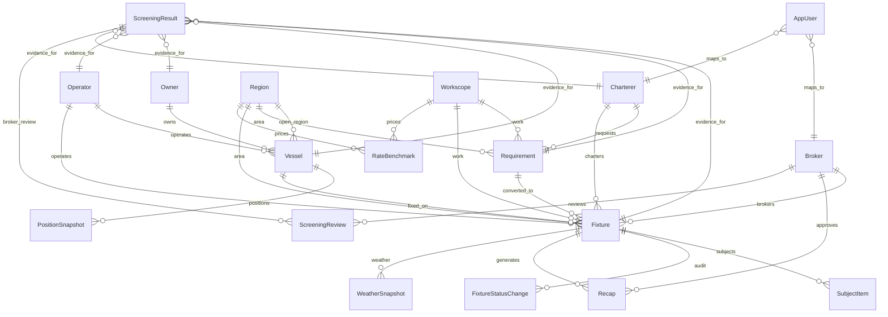

# Neon Table Map

This document is a meeting-friendly map of the FixtureLog tables that exist in Neon/Postgres. It is
sourced from `prisma/schema.prisma` and the committed Prisma migrations.

For the route-level view, see `docs/architecture/API-TO-NEON-TABLE-MAP.md`.

Prisma creates quoted PascalCase table names, so in Neon you will see tables such as `"Vessel"`,
`"Requirement"`, and `"Fixture"` rather than lowercase snake_case names.

## Mental Model

FixtureLog is built around one commercial workflow:

1. A charterer has a requirement.
2. The broker matches that requirement to vessels.
3. A selected vessel becomes a fixture.
4. The fixture moves through subjects, weather evidence, screening evidence, status changes, and recap.



## ASCII Overview

Use this if the Mermaid diagram is hard to read in a terminal, PR comment, or interview note.

```text
AUTH + PARTIES

OIDC login
  -> AppUser
      -> Broker     -> Fixture -> Recap
                   \-> ScreeningReview
      -> Charterer  -> Requirement -> Fixture


REFERENCE + FLEET

Owner    -> Vessel -> PositionSnapshot
Operator -> Vessel
Operator -> Fixture

Region + Workscope + RateBenchmark
  -> Requirement
  -> Fixture
  -> FixtureMatcher service


COMMERCIAL WORKFLOW

Charterer
  -> Requirement
      -> Fixture
          -> SubjectItem
          -> FixtureStatusChange
          -> WeatherSnapshot
          -> Recap


SCREENING EVIDENCE

ScreeningResult
  -> Fixture
  -> Requirement
  -> Vessel
  -> Owner
  -> Operator
  -> Charterer
  -> ScreeningReview by Broker
```

## Table Groups

| Group | Tables | Why they matter |
|---|---|---|
| Parties and auth | `Owner`, `Operator`, `Charterer`, `Broker`, `AppUser` | Who owns vessels, who operates them, who requests work, who brokers deals, and which login maps to which actor. |
| Reference data | `Region`, `Workscope`, `RateBenchmark` | Controlled domain vocabulary: areas, work types, and commercial rate context. |
| Fleet | `Vessel`, `PositionSnapshot` | The seeded offshore fleet and its latest/previous map positions. |
| Commercial workflow | `Requirement`, `Fixture`, `SubjectItem`, `FixtureStatusChange`, `Recap`, `WeatherSnapshot` | The core enquiry-to-recap workflow. |
| Broker review evidence | `ScreeningResult`, `ScreeningReview` | Stored sanctions/operator-risk evidence and the human broker review trail. |

## Tables

| Table | Purpose | Key links |
|---|---|---|
| `Owner` | Vessel-owning company with latest screening cache fields. | `Vessel.ownerId`, `ScreeningResult.ownerId` |
| `Operator` | Vessel/operator party added for sanctions/operator-risk review. | `Vessel.operatorId`, `Fixture.operatorId`, `ScreeningResult.operatorId` |
| `Charterer` | Client company placing requirements and taking fixtures. | `Requirement.chartererId`, `Fixture.chartererId`, `AppUser.chartererId`, `ScreeningResult.chartererId` |
| `Broker` | Internal broker actor who works fixtures and reviews evidence. | `Fixture.brokerId`, `Recap.approvedByBrokerId`, `AppUser.brokerId`, `ScreeningReview.brokerId` |
| `AppUser` | Auth identity mapping from OIDC login to either broker or charterer role. | `brokerId`, `chartererId`, `role` |
| `Region` | Operating area such as North Sea, Brazil, US Gulf. | `Requirement.regionId`, `Fixture.regionId`, `Vessel.openRegionId`, `RateBenchmark.regionId` |
| `Workscope` | Work type such as supply, anchor handling, IMR, standby. | `Requirement.workscopeId`, `Fixture.workscopeId`, `RateBenchmark.workscopeId` |
| `RateBenchmark` | Reference rates by region, vessel type, workscope, and date. | `regionId`, optional `workscopeId` |
| `Vessel` | Offshore vessel profile: type, DP class, owner, operator, open region, image provenance, screening cache. | `ownerId`, optional `operatorId`, optional `openRegionId` |
| `PositionSnapshot` | Vessel position and confidence/provenance for map rendering. | `vesselId` |
| `Requirement` | Charterer enquiry: vessel type, laycan, region, workscope, budget, status. | `chartererId`, `regionId`, `workscopeId` |
| `Fixture` | Agreed or in-progress deal created from a vessel and optionally a requirement. | `requirementId`, `vesselId`, `chartererId`, `brokerId`, `operatorId`, `regionId`, `workscopeId` |
| `SubjectItem` | Subject checklist items that must be lifted, waived, or fail. | `fixtureId` |
| `FixtureStatusChange` | Append-only audit trail for fixture status transitions. | `fixtureId` |
| `Recap` | Generated SUPPLYTIME recap markdown/text plus main terms. | `fixtureId`, optional `approvedByBrokerId` |
| `WeatherSnapshot` | Persisted marine weather evidence for a fixture/work window. | optional `fixtureId` |
| `ScreeningResult` | Immutable screening evidence for vessels, parties, requirements, and fixtures. | optional links to `Fixture`, `Requirement`, `Vessel`, `Owner`, `Operator`, `Charterer` |
| `ScreeningReview` | Human broker review action for a screening result. | `screeningResultId`, `brokerId` |

## Main Relationship Paths

### Broker Workflow

```text
Charterer
  -> Requirement
    -> Fixture
      -> SubjectItem
      -> FixtureStatusChange
      -> WeatherSnapshot
      -> Recap
```

### Fleet Matching Context

```text
Owner -> Vessel -> PositionSnapshot
Operator -> Vessel
Region + Workscope + RateBenchmark -> matching context
Requirement -> FixtureMatcher service -> Fixture
```

`FixtureMatcher` is not a table. It is the deterministic service that reads `Requirement`, `Vessel`,
`Region`, `Workscope`, and `RateBenchmark` data to produce a shortlist.

### Auth and Role Scope

```text
OIDC login -> AppUser
  -> Broker workspace if role = BROKER and brokerId is set
  -> Charterer portal if role = CLIENT and chartererId is set
```

### Review Evidence

```text
ScreeningResult
  -> Vessel / Owner / Operator / Charterer / Requirement / Fixture
  -> ScreeningReview by Broker
```

The product does not auto-clear a vessel. Screening and weather are evidence for broker review; the
deterministic backend remains the write authority.

## Status Enums To Know

| Enum | Values |
|---|---|
| `RequirementStatus` | `ENQUIRY`, `SHORTLISTED`, `NEGOTIATING`, `ON_SUBS`, `FIXED`, `LOST` |
| `FixtureStatus` | `DRAFT`, `NEGOTIATING`, `ON_SUBS`, `FIXED`, `COMPLETED`, `FAILED` |
| `SubjectItemStatus` | `PENDING`, `LIFTED`, `WAIVED`, `FAILED` |
| `ScreeningStatus` | `CLEAR`, `REVIEW`, `BLOCKED` |
| `AppRole` | `BROKER`, `CLIENT` |

## Seed Snapshot

The current seed script populates the demo database with:

| Seeded data | Count |
|---|---:|
| Owners | 8 |
| Charterers | 6 |
| Brokers | 4 |
| Regions | 7 |
| Workscopes | 9 |
| Vessels + position snapshots | 30 |
| Rate benchmarks | 6 |
| Requirements | 5 |
| Fixtures | 5 |
| Subject items | 5 |
| Recaps | 2 |
| Weather snapshots | 4 |

## Interview Explanation

Use this phrasing:

> The Neon schema is intentionally domain-shaped. It is not just CRUD tables: it models the offshore
> fixture lifecycle. Requirements come from charterers, vessels belong to owners and operators,
> fixtures join the commercial parties, and evidence tables like weather snapshots, screening
> results, status changes, and recaps preserve why a broker made a decision.
