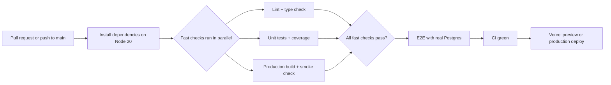

# CI/CD Pipeline

How FixtureLog moves from pull request to verified deployable build.

FixtureLog uses four GitHub Actions jobs. Three jobs run first in parallel for fast feedback. If
they pass, the slower E2E job runs with a real Postgres service.



ASCII version:

```text
Pull request / main push
  -> install on Node 20
  -> run three fast checks at the same time
       1. lint + typecheck
       2. unit tests + coverage
       3. production build + health smoke check
  -> if all three pass, run Playwright E2E with Postgres 16
  -> CI green
  -> Vercel preview or production deploy
```

## What to Say in the Interview

- "The pipeline has three fast checks first: code quality, unit coverage, and production build."
- "Those checks run in parallel, so I get quick feedback instead of waiting for one long job."
- "If the fast checks pass, Playwright runs with a real Postgres database."
- "GitHub Actions verifies the code. Vercel owns the preview or production deployment."
- "The important thing is confidence by layers: static checks, unit tests, build, smoke test, then E2E."

## What Each Check Does

| Check | Command or step | What it proves |
|---|---|---|
| Install | `npm ci` | The lockfile is valid and the app can install from a clean machine. |
| Security audit | `npm audit --audit-level=high` | The full dependency tree has no known high-severity vulnerability. |
| Production-only audit | `npm audit --audit-level=high --omit=dev` | Runtime dependencies are also checked without dev packages. |
| Prisma generation | `npx prisma generate` | Prisma Client can be generated from the current schema. TypeScript can then use the database types. |
| Type check | `npm run typecheck` | TypeScript accepts the app without emitting JavaScript. This catches wrong props, wrong return shapes, and schema/type drift. |
| Lint | `npm run lint` | The code follows the Next.js/ESLint rules and avoids common mistakes before runtime. |
| Unit and service tests | `npm run test:coverage` | Vitest runs the focused tests for services, routes, components, and policies. Coverage proves the important paths are exercised. |
| Coverage upload | Codecov upload | The coverage report is saved outside the job, so coverage changes can be reviewed on the PR. |
| Production build | `npm run build` | Next.js can compile the real production app. This catches server/client boundary issues that unit tests may miss. |
| Bundle budget | Parse `First Load JS shared by all` | The shared client JavaScript must stay under the budget, currently 200 kB. This stops accidental client-side bloat. |
| Smoke check | `npm start` then `GET /api/health` | The built app can start as a production server, and the health endpoint responds. This checks the build is actually bootable. |
| E2E database | Postgres 16 service | Playwright does not run against mocks. It gets a real database like the production architecture. |
| Migrations | `npx prisma migrate deploy` | The committed migrations can build the database schema from scratch. |
| Seed data | `npx prisma db seed` | Demo data can be created in a clean database. E2E starts from a known state. |
| Browser E2E | `npx playwright test` | Chromium opens the app and checks the main user journeys: landing, smoke, map, and happy-path flows. |
| E2E report | Upload Playwright report on failure | If E2E fails, the report is kept as an artifact so the failure can be inspected without guessing. |

## Design Decisions

- Node 20 is pinned for consistent Next.js, Prisma, Vitest, and Playwright behavior.
- `prisma generate` runs in every job that touches generated Prisma types.
- The health endpoint stays public so deploy smoke checks do not need auth.
- Bundle size is parsed from `next build` output to catch accidental client-side bloat.
- Failed E2E uploads the Playwright report so failures can be inspected without rerunning locally.

## Short Rehearsal Version

> I split CI into layers. First I check the code without a browser: audit, typecheck, lint, unit
> tests, coverage, and production build. Then I start the built app and hit `/api/health`. If that is
> fine, I run Playwright with a real Postgres database. That gives me confidence that the code
> compiles, the database schema works, and the main user flows work in a browser.
