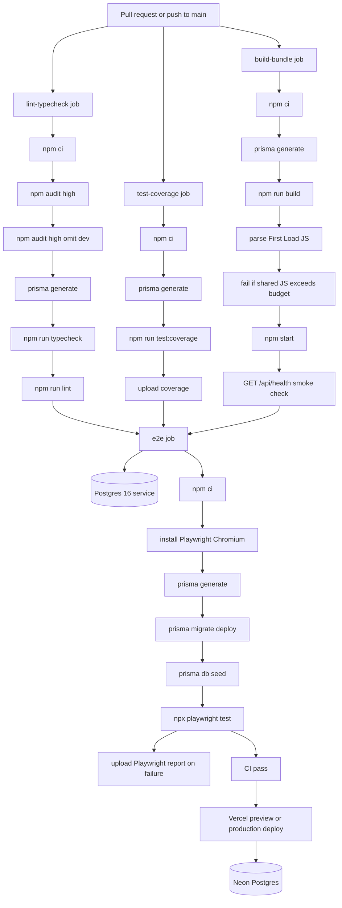

# CI/CD Pipeline

How FixtureLog moves from pull request to verified deployable build.

FixtureLog uses the Learning Speaking App pattern: parallel GitHub Actions jobs for fast feedback, Node 20, Prisma generation, security audit, coverage, bundle budget, smoke check, and E2E with a real Postgres service.

## What to Say in the Interview

- "The pipeline is split into parallel jobs so slow E2E does not block fast lint/type/build feedback."
- "The build job does more than compile. It checks bundle size and starts the production server for a health smoke test."
- "E2E uses a real Postgres service, applies migrations, seeds data, and then runs Playwright. That proves the app works with the same database contract it uses in production."
- "Auth secrets are placeholder values in CI; production secrets live in Vercel."
- "Vercel owns deployment. GitHub Actions owns verification."

## Design Decisions

- Node 20 is pinned for consistent Next.js, Prisma, Vitest, and Playwright behavior.
- `prisma generate` runs in every job that touches generated Prisma types.
- The health endpoint stays public so deploy smoke checks do not need auth.
- Bundle size is parsed from `next build` output to catch accidental client-side bloat.
- Failed E2E uploads the Playwright report so failures can be inspected without rerunning locally.
