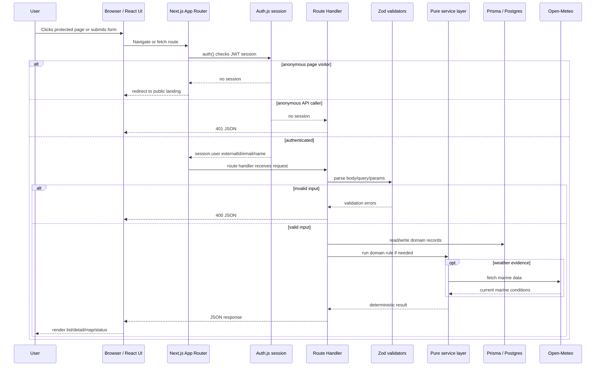
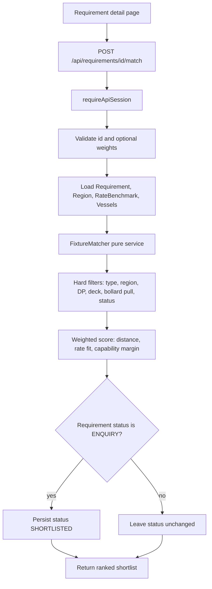
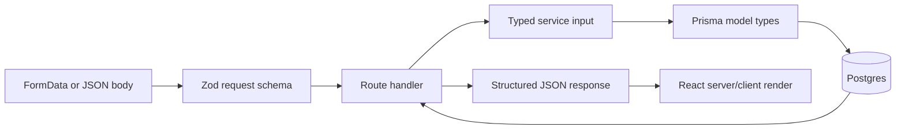

# Request Flow

How a user action becomes a validated FixtureLog response.

This graph uses the same mental model as the Helical request-flow document: browser state crosses a fetch boundary, the server validates the request, domain services perform deterministic work, Prisma reads or writes Postgres, and the response is validated/structured before the UI renders it.

## Example: Requirement Matching

## Type Safety Chain

## What to Say in the Interview

- "Every external boundary is parsed with Zod: body, query, route params, auth profile, and external weather payloads."
- "Route handlers own I/O. Pure services own domain decisions."
- "The matching engine does not know about HTTP or Prisma. That makes it easy to unit test."
- "Protected APIs return 401 JSON; protected pages redirect to the public landing."
- "Write routes derive the broker actor from the session, not from the request body."
