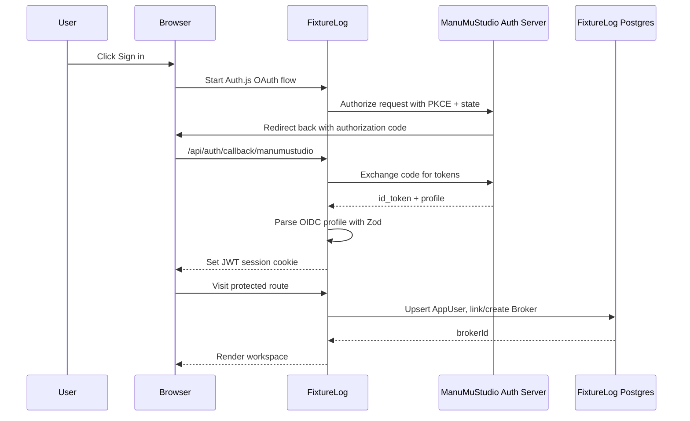
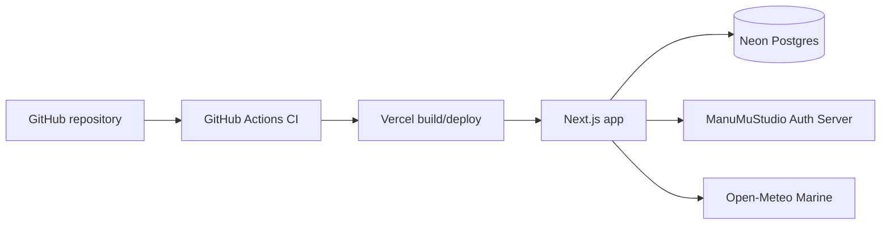

# Runtime Flow

How FixtureLog runs in production after public landing and auth integration.

```mermaid
flowchart TB
  User[User] --> Browser[Browser]

  Browser --> Landing[Public landing /]
  Landing --> AuthCTA[Sign in / create account CTA]
  AuthCTA --> AuthServer[ManuMuStudio OIDC provider]
  AuthServer --> Callback[/api/auth/callback/manumustudio]
  Callback --> Cookie[Auth.js JWT session cookie]

  Browser --> Protected[(app) protected route group]
  Protected --> PageGuard[requireSession]
  PageGuard --> Workspace[Map / requirements / charterers]

  Browser --> API[Domain API routes]
  API --> ApiGuard[requireApiSession]
  ApiGuard --> Actor[resolveActor AppUser -> Broker]
  Actor --> Validation[Zod body/query/params validation]
  Validation --> Service[Pure TypeScript service layer]
  Service --> Prisma[Prisma Client]
  Prisma --> Neon[(Neon Postgres)]

  Service --> Weather[Open-Meteo Marine]
  Weather --> Service

  API --> JSON[Structured JSON response]
  Workspace --> Browser
  JSON --> Browser

  Browser --> SignOut[/api/auth/federated-signout]
  SignOut --> AuthServer
  AuthServer --> Landing
```

## Layer Responsibilities

| Layer | Responsibility |
|---|---|
| Public landing | Product story, screenshots, real auth CTAs, no protected data |
| Auth.js routes | OIDC callback, JWT session, federated sign-out |
| Protected route group | Redirect anonymous visitors before operational pages render |
| API guards | Return 401 JSON for unauthenticated API calls |
| Actor mapping | Convert OIDC identity into a business `Broker` actor |
| Zod validators | Keep malformed data out of route handlers and external API boundaries |
| Service layer | Matching, weather verdicts, fixture status policy, recap formatting |
| Prisma/Postgres | Persistent source of truth for vessels, charterers, requirements, fixtures, recaps, snapshots, users |
| Open-Meteo | Real marine weather evidence; not the system of record |

## Auth Flow



## Deployment Shape



## What to Say in the Interview

- "The protected app is not a separate URL namespace. I use a route group, so public URLs stay clean while the layout enforces auth."
- "Auth server and app are separate systems. FixtureLog is an OIDC client, not an identity provider."
- "The actor used in writes is resolved from the session. The request body cannot choose a broker."
- "The middleware only applies security headers and excludes `/api/auth/*`; auth gating happens in server components and API handlers where server-only dependencies are safe."
- "The runtime shape is simple: Vercel app, Neon database, shared auth server, Open-Meteo weather."
